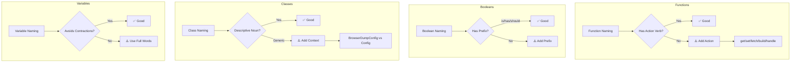

# Instagram Scraper Codebase Naming Analysis

**Analysis Date:** 2026-03-09  
**Framework:** A/HC/LC Pattern + S-I-D Principles  
**Reference:** [kettanaito/naming-cheatsheet](https://github.com/kettanaito/naming-cheatsheet)

---

## Executive Summary

The codebase demonstrates **generally strong naming conventions** with consistent use of Python naming standards (snake_case for functions/variables, PascalCase for classes). However, several inconsistencies and violations of the A/HC/LC pattern were identified that could be improved for better code readability and maintainability.

**Overall Assessment:** ⭐⭐⭐⭐ (4/5) - Good with room for improvement

---

## Analysis by Category

### 1. Classes and Dataclasses ✅ Excellent

| Name | Pattern | Assessment |
|------|---------|------------|
| `RetryConfig` | Noun + Context | ✅ Clear, descriptive |
| `HttpConfig` | Noun + Context | ✅ Clear |
| `OutputConfig` | Noun + Context | ✅ Clear |
| `ScraperConfig` | Noun + Context | ✅ Clear |
| `CommentRow` | Noun + Context | ✅ Clear |
| `CommentBatch` | Noun + Context | ✅ Clear |
| `JSONFormatter` | Noun + Context | ✅ Clear |
| `LogContext` | Noun + Context | ✅ Clear |

**Issue Found:**

| Name | File | Issue |
|------|------|-------|
| `Config` | [`scrape_instagram_from_browser_dump.py`](src/instagram_scraper/scrape_instagram_from_browser_dump.py:112), [`download_instagram_videos.py`](src/instagram_scraper/download_instagram_videos.py:108) | Too generic - should be module-specific like `BrowserDumpConfig` and `VideoDownloadConfig` |

---

### 2. Functions - A/HC/LC Pattern Analysis

#### ✅ Excellent Examples (Follow A/HC/LC)

| Function | Prefix | Action | High Context | Low Context |
|----------|--------|--------|--------------|-------------|
| `get_logger` | | get | Logger | |
| `build_async_instagram_session` | | build | InstagramSession | Async |
| `fetch_comments_page` | | fetch | Comments | Page |
| `fetch_media_id` | | fetch | MediaId | |
| `download_video_file` | | download | VideoFile | |
| `request_with_retry` | | request | WithRetry | |
| `async_request_with_retry` | async | request | WithRetry | |
| `_collect_comments` | | collect | Comments | |
| `_write_posts_csv` | | write | PostsCsv | |
| `_is_retryable_error` | | is | RetryableError | |

#### ⚠️ Issues - Missing Action Verbs

| Current Name | File | Issue | Recommended |
|--------------|------|-------|-------------|
| [`cookie_value`](src/instagram_scraper/_async_http.py:72) | `_async_http.py` | Missing action verb | `get_cookie_value` or `extract_cookie_value` |
| [`json_payload`](src/instagram_scraper/_instagram_http.py:162) | `_instagram_http.py` | Missing action verb | `get_json_payload` or `parse_json_payload` |
| [`json_error`](src/instagram_scraper/_instagram_http.py:200) | `_instagram_http.py` | Missing action verb | `format_json_error` or `compose_json_error` |
| [`_output_dir`](src/instagram_scraper/scrape_instagram_profile.py:100) | `scrape_instagram_profile.py` | Missing action verb | `_get_output_dir` |

---

### 3. Boolean Variables and Parameters

#### ✅ Good Examples

| Name | Prefix | Context |
|------|--------|---------|
| `is_video` | `is` | Characteristic ✅ |
| `has_more` | `has` | Possession ✅ |
| `_is_retryable_error` | `is` | Characteristic ✅ |
| `AIOHTTP_AVAILABLE` | (implied `is`) | Module constant ✅ |

#### ⚠️ Could Be Improved

| Current Name | File | Issue | Recommended |
|--------------|------|-------|-------------|
| `reset_output` | [`config.py`](src/instagram_scraper/config.py:95), multiple | Not a boolean prefix | `should_reset_output` |
| `resume` | [`config.py`](src/instagram_scraper/config.py:120), multiple | Not a boolean prefix | `should_resume` |

**Note:** While `reset_output` and `resume` are understandable in context, they don't follow the `is`/`has`/`should` boolean prefix convention which would make their boolean nature more explicit.

---

### 4. Constants (UPPER_SNAKE_CASE)

#### ✅ Excellent Examples

| Name | Pattern | Assessment |
|------|---------|------------|
| `DEFAULT_USER_AGENT` | DEFAULT_ prefix | ✅ Clear default value |
| `SUCCESS_STATUS` | Descriptive | ✅ Clear |
| `RETRYABLE_STATUSES` | Plural collection | ✅ Clear |
| `DEFAULT_POOL_LIMIT` | DEFAULT_ prefix | ✅ Clear |
| `MIN_DELAY_MINIMUM` | MIN/MAX boundary | ✅ Clear |
| `MIN_RETRIES` | MIN boundary | ✅ Clear |
| `MAX_RETRIES` | MAX boundary | ✅ Clear |
| `MEDIA_TYPE_VIDEO` | Domain + Type | ✅ Clear |
| `MEDIA_TYPE_CAROUSEL` | Domain + Type | ✅ Clear |

#### ⚠️ Could Be Improved

| Current Name | File | Issue | Recommended |
|--------------|------|-------|-------------|
| `RANDOM` | [`_async_http.py:66`](src/instagram_scraper/_async_http.py:66), [`_instagram_http.py:29`](src/instagram_scraper/_instagram_http.py:29) | Too generic | `SYSTEM_RANDOM` or `CRYPTOGRAPHIC_RANDOM` |

---

### 5. Variables (snake_case)

#### ✅ Excellent Examples

| Name | Context | Assessment |
|------|---------|------------|
| `retry_config` | Configuration | ✅ Clear |
| `cookie_header` | HTTP | ✅ Clear |
| `media_id` | Instagram | ✅ Clear |
| `shortcode` | Instagram | ✅ Clear |
| `post_url` | URL | ✅ Clear |
| `owner_username` | User | ✅ Clear |
| `comment_like_count` | Count | ✅ Clear |
| `next_cursor` | Pagination | ✅ Clear |

#### ⚠️ Issues in Test Files - Contractions

| Current Name | File | Issue | Recommended |
|--------------|------|-------|-------------|
| `rc` | [`test_config.py:17`](tests/test_config.py:17) | Contractions avoided | `retry_config` |
| `hc` | [`test_config.py:31`](tests/test_config.py:31) | Contractions avoided | `http_config` |
| `oc` | [`test_config.py:41`](tests/test_config.py:41) | Contractions avoided | `output_config` |
| `sc` | [`test_config.py:48`](tests/test_config.py:48) | Contractions avoided | `scraper_config` |
| `ne` | [`test_exceptions.py:47`](tests/test_exceptions.py:47) | Contractions avoided | `network_error` |
| `e` | [`test_exceptions.py:21`](tests/test_exceptions.py:21), etc. | Single letter | `error` or `exception` |

**Note:** While test variable names can be shorter, avoiding contractions improves readability.

---

### 6. Protocol Classes ✅ Excellent

| Name | Prefix | Assessment |
|------|--------|------------|
| `HasRetryConfig` | `Has` | ✅ Perfect for protocol indicating capability |
| `HasOutputDir` | `Has` | ✅ Perfect for protocol indicating capability |
| `_AsyncResponseLike` | `Like` suffix | ✅ Clear duck-typing protocol |
| `_AsyncSessionLike` | `Like` suffix | ✅ Clear duck-typing protocol |
| `_SyncFile` | Context | ✅ Clear |
| `_ResponseReleaser` | Context | ✅ Clear |

---

### 7. TypedDict Classes ✅ Good

| Name | Assessment |
|------|------------|
| `_CheckpointState` | ✅ Clear |
| `_PostRow` | ✅ Clear |
| `_CommentRow` | ✅ Clear |
| `_ErrorRow` | ✅ Clear |
| `_OutputPaths` | ✅ Clear |
| `_RunMetrics` | ✅ Clear |
| `_DownloadPaths` | ✅ Clear |
| `_DownloadMetrics` | ✅ Clear |

#### ⚠️ Naming Conflict

| Name | Files | Issue |
|------|-------|-------|
| `_CommentRow` | [`async_comments.py:18`](src/instagram_scraper/async_comments.py:18) (dataclass), [`scrape_instagram_from_browser_dump.py:64`](src/instagram_scraper/scrape_instagram_from_browser_dump.py:64) (TypedDict) | Same name, different types in different modules |

**Recommendation:** This is acceptable since they're private (`_` prefix) and module-scoped, but could be confusing. Consider `_AsyncCommentRow` vs `_BrowserDumpCommentRow` if ever merged.

---

### 8. Exception Classes ✅ Excellent

| Name | Pattern | Assessment |
|------|---------|------------|
| `InstagramError` | Domain + Error | ✅ Clear base class |
| `InstagramAPIError` | Domain + API + Error | ✅ Clear hierarchy |
| `RateLimitError` | Context + Error | ✅ Clear |
| `MediaNotFoundError` | Context + NotFound + Error | ✅ Clear |
| `AuthenticationError` | Context + Error | ✅ Clear |
| `NetworkError` | Context + Error | ✅ Clear |
| `ParseError` | Context + Error | ✅ Clear |

---

### 9. Error Codes Enum ✅ Good

| Name | Assessment |
|------|------------|
| `HTTP_400`, `HTTP_401`, etc. | ✅ Clear HTTP status mapping |
| `NETWORK_TIMEOUT` | ✅ Clear |
| `NETWORK_CONNECTION` | ✅ Clear |
| `MEDIA_NOT_FOUND` | ✅ Clear |
| `PARSE_NON_JSON` | ✅ Clear |
| `UNKNOWN` | ✅ Clear fallback |

#### ⚠️ Minor Suggestions

| Current Name | Issue | Recommended |
|--------------|-------|-------------|
| `HTTP_OTHER` | Less descriptive | `HTTP_UNKNOWN` |
| `NETWORK_OTHER` | Less descriptive | `NETWORK_UNKNOWN` |

---

### 10. Inconsistencies Found

#### Function Naming Inconsistency

| Concept | Async Module | Sync Module | Issue |
|---------|--------------|-------------|-------|
| Sleep/delay | `randomized_sleep` | `randomized_delay` | Different names for same concept |

**Files:**
- [`_async_http.py:139`](src/instagram_scraper/_async_http.py:139) - `randomized_sleep`
- [`_instagram_http.py:99`](src/instagram_scraper/_instagram_http.py:99) - `randomized_delay`

**Recommendation:** Standardize to `randomized_delay` for both, or use `async_randomized_delay` for the async version.

#### Config Class Duplication

| Class | File 1 | File 2 | Issue |
|-------|--------|--------|-------|
| `Config` | [`scrape_instagram_from_browser_dump.py:112`](src/instagram_scraper/scrape_instagram_from_browser_dump.py:112) | [`download_instagram_videos.py:108`](src/instagram_scraper/download_instagram_videos.py:108) | Same generic name, different structures |

**Recommendation:** Rename to `BrowserDumpConfig` and `VideoDownloadConfig` respectively.

---

## Summary of Findings

### ✅ Strengths

1. **Consistent Python conventions** - snake_case for functions/variables, PascalCase for classes
2. **Excellent exception hierarchy** - Clear inheritance and descriptive names
3. **Good use of protocols** - `Has` prefix for capability protocols
4. **Proper use of private prefix** - Underscore for module-private items
5. **Clear constant naming** - UPPER_SNAKE_CASE with descriptive prefixes
6. **Good A/HC/LC adherence** - Most functions follow the pattern

### ⚠️ Areas for Improvement

| Priority | Issue | Count | Effort |
|----------|-------|-------|--------|
| High | Missing action verbs on functions | 4 | Low |
| Medium | Boolean parameter naming | 2 | Medium |
| Medium | Inconsistent delay/sleep naming | 2 | Low |
| Low | Generic `Config` class names | 2 | Medium |
| Low | Test variable contractions | 6 | Low |
| Low | Generic `RANDOM` constant | 2 | Low |

---

## Recommended Actions

### High Priority

1. **Add action verbs to functions:**
   - `cookie_value` → `get_cookie_value`
   - `json_payload` → `get_json_payload`
   - `json_error` → `format_json_error`
   - `_output_dir` → `_get_output_dir`

### Medium Priority

2. **Standardize delay function naming:**
   - Rename `randomized_sleep` to `randomized_delay` in `_async_http.py`
   - Or rename both to `wait_with_jitter` for more descriptive naming

3. **Rename generic Config classes:**
   - `Config` in `scrape_instagram_from_browser_dump.py` → `BrowserDumpConfig`
   - `Config` in `download_instagram_videos.py` → `VideoDownloadConfig`

### Low Priority

4. **Improve boolean parameter names:**
   - `reset_output` → `should_reset_output`
   - `resume` → `should_resume`
   
   **Note:** This would require updating all call sites and may not be worth the churn.

5. **Expand test variable names:**
   - `rc` → `retry_config`
   - `hc` → `http_config`
   - `oc` → `output_config`
   - `sc` → `scraper_config`
   - `ne` → `network_error`
   - `e` → `error`

6. **Rename generic constant:**
   - `RANDOM` → `SYSTEM_RANDOM`

---

## Mermaid Diagram: Naming Convention Flow

---

## Conclusion

The Instagram scraper codebase demonstrates solid naming practices overall. The main areas for improvement are:

1. **Adding action verbs** to a small set of functions that currently lack them
2. **Standardizing naming** between async and sync modules for the same concept
3. **Making Config classes more specific** to avoid generic names

These improvements would enhance code readability and maintain consistency with the A/HC/LC pattern and S-I-D principles.
