# Naming Fix Implementation Plan

**Generated:** 2026-03-09  
**Framework:** A/HC/LC Pattern + S-I-D Principles  
**Reference:** [kettanaito/naming-cheatsheet](https://github.com/kettanaito/naming-cheatsheet)

---

## Overview

This plan addresses all naming issues identified in the Instagram scraper codebase. Changes are organized by file and priority level to minimize merge conflicts and ensure backward compatibility.

---

## Summary of Changes

| Priority | File | Change Count | Impact |
|----------|------|-------------|--------|
| **High** | `src/instagram_scraper/_async_http.py` | 2 | Breaking change, Low |
| **High** | `src/instagram_scraper/_instagram_http.py` | 2 | Breaking change, Low |
| **High** | `src/instagram_scraper/scrape_instagram_profile.py` | 1 | Low |
| **Medium** | `src/instagram_scraper/config.py` | 2 | Medium |
| **Low** | `tests/test_config.py` | 4 | Low |
| **Low** | `tests/test_exceptions.py` | 1 | Low |

| **Low** | `src/instagram_scraper/error_codes.py` | 2 | Low |

---

## Detailed Changes by File

### 1. [`_async_http.py`](src/instagram_scraper/_async_http.py)

**HIGH PRIORITY - Breaking Change**

| Line | Current | Proposed | Reason |
|------|---------|----------|--------|
| 66 | `RANDOM = SystemRandom()` | Too generic - violates S-I-D principles |
 72-83 | `def cookie_value(...)` | `def get_cookie_value(...)` | Missing action verb per A/HC/LC pattern |
 139-146 | `async def randomized_sleep(...)` | `async def randomized_delay(...)` | Inconsistent with sync module |

**Changes:**

```python
# Line 66: Rename constant
RANDOM = SYSTEM_RANDOM

# Line 72: Rename function
def cookie_value(cookie_header: str, key: str) -> str | None:
# becomes
def get_cookie_value(cookie_header: str, key: str) -> str | None:

# Line 139: Rename function  
async def randomized_sleep(...) -> None:
# becomes
async def randomized_delay(...) -> None:

# Line 33: Update __all__ export
__all__ = [
    "RetryConfig",
    "async_json_payload",
    "async_request_with_retry",
    "build_async_instagram_session",
    "get_cookie_value",  # was cookie_value
    "randomized_delay",  # was randomized_sleep
]
```

**Call Sites to Update:**
- All imports of `cookie_value` must `get_cookie_value`
- All references in codebase using `cookie_value` (via grep search)

---

### 2. [`_instagram_http.py`](src/instagram_scraper/_instagram_http.py)

**HIGH PRIORITY - Breaking Change**

| Line | Current | Proposed | Reason |
|------|---------|----------|--------|
| 29 | `RANDOM = SystemRandom()` | Too generic - violates S-I-D principles |
 86-96 | `def cookie_value(...)` | `def get_cookie_value(...)` | Missing action verb, Keep consistent with async module |
 162-178 | `def json_payload(...)` | `def get_json_payload(...)` | Missing action verb |
 200-218 | `def json_error(...)` | `def format_json_error(...)` | Missing action verb - returns formatted error string |

**Changes:**

```python
# Line 29: Rename constant
RANDOM = SYSTEM_RANDOM

# Line 86: Rename function
def cookie_value(...) -> None:
# becomes
def get_cookie_value(...) -> None:

# Line 162: Rename function
def json_payload(...) -> None:
# becomes
def get_json_payload(...) -> None:

# Line 200: Rename function  
def json_error(...) -> None:
# becomes
def format_json_error(...) -> None:
```

**Call Sites to Update:**
- All imports of `cookie_value` → `get_cookie_value`
- All imports of `json_payload` → `get_json_payload`
  
---

### 3. [`scrape_instagram_profile.py`](src/instagram_scraper/scrape_instagram_profile.py)

**HIGH PRIORITY - Low Impact**

| Line | Current | Proposed | Reason |
|------|---------|----------|--------|
| 100 | `def _output_dir(...)` | `def _get_output_dir(...)` | Missing action verb |

**Changes:**

```python
# Line 100: Rename function
def _output_dir(username: str) -> Path:
# becomes
def _get_output_dir(username: str) -> Path:
```

**Call Sites to Update:**
- Single call site at line 103

---

### 4. [`config.py`](src/instagram_scraper/config.py)

**MEDIUM PRIORITY - Medium Impact**

| Line | Current | Proposed | Reason |
|------|---------|----------|--------|
| 95 | `reset_output: bool` | `should_reset_output: bool` | Boolean should use is/has/should prefix |
| 120 | `resume: bool` | `should_resume: bool` | Boolean should use is/has/should prefix |

**Changes:**

```python
# Line 95: Rename field
reset_output: bool = False
# becomes
should_reset_output: bool = False

# Line 120: Rename field
resume: bool = False
# becomes
should_resume: bool = False
```

**Call Sites to Update:**
This is a **breaking change** that affects:
- All CLI argument parsing (`--reset-output`, `--resume`)
- All conditionals checking these booleans
- All dataclass instantiations
- Documentation updates

**Affected Files:**
- [`scrape_instagram_from_browser_dump.py`](src/instagram_scraper/scrape_instagram_from_browser_dump.py) - Lines 118, 143, 159-160, 164
 165
- [`download_instagram_videos.py`](src/instagram_scraper/download_instagram_videos.py) - Lines 114, 143-144, 158-159, 164
 165
- [`async_comments.py`](src/instagram_scraper/async_comments.py) - Any usage of these config fields

- [`cli.py`](src/instagram_scraper/cli.py) - Any usage
 these config fields

- All test files that instantiate these configs

---

### 5. [`test_config.py`](tests/test_config.py)

**LOW PRIORITY - Low Impact**

| Line | Current | Proposed | Reason |
|------|---------|----------|--------|
| 17 | `rc = RetryConfig()` | `retry_config = RetryConfig()` | Avoid contractions |
| 31 | `hc = HttpConfig()` | `http_config = HttpConfig()` | Avoid contractions |
| 41 | `oc = OutputConfig()` | `output_config = OutputConfig()` | Avoid contractions |
| 48 | `sc = ScraperConfig()` | `scraper_config = ScraperConfig()` | Avoid contractions |

**Changes:**

```python
# Line 17
rc = RetryConfig()
# becomes
retry_config = RetryConfig()

# Line 31  
hc = HttpConfig()
# becomes
http_config = HttpConfig()

# Line 41
oc = OutputConfig()
# becomes
output_config = OutputConfig()

# Line 48
sc = ScraperConfig()
# becomes
scraper_config = ScraperConfig()
```

---

### 6. [`test_exceptions.py`](tests/test_exceptions.py)

**LOW PRIORITY - Low Impact**

| Line | Current | Proposed | Reason |
|------|---------|----------|--------|
| 47 | `ne = NetworkError.from_exception(...)` | `network_error = NetworkError.from_exception(...)` | Avoid contractions |

**Changes:**

```python
# Line 47
ne = NetworkError.from_exception(exc, "http://example.com")
# becomes
network_error = NetworkError.from_exception(exc, "http://example.com")
```

---

### 7. [`error_codes.py`](src/instagram_scraper/error_codes.py)

**LOW PRIORITY - Low Impact**

| Current | Proposed | Reason |
|------|---------|----------|--------|
| `HTTP_OTHER` | `HTTP_UNKNOWN` | More descriptive |
| `NETWORK_OTHER` | `NETWORK_UNKNOWN` | More descriptive |

**Note:** These are enum members, not standalone variables. Changing them affects error code serialization and any code that references these specific codes.

 Consider if the churn is worth it.

---

## Implementation Order

### Phase 1: Core Infrastructure (Breaking Changes)

1. **Update `_async_http.py`**
   - Rename `RANDOM` → `SYSTEM_RANDOM`
   - Rename `cookie_value` → `get_cookie_value`
   - Rename `randomized_sleep` → `randomized_delay`
   - Update `__all__` list

2. **Update `_instagram_http.py`**
   - Rename `RANDOM` → `SYSTEM_RANDOM`
   - Rename `cookie_value` → `get_cookie_value`
   - Rename `json_payload` → `get_json_payload`
   - Rename `json_error` → `format_json_error`

3. **Update `scrape_instagram_profile.py`**
   - Rename `_output_dir` → `_get_output_dir`

### Phase 2: Configuration (Breaking Changes)

4. **Update `config.py`**
   - Rename `reset_output` → `should_reset_output`
   - Rename `resume` → `should_resume`

5. **Update all call sites for config changes:**
   - `scrape_instagram_from_browser_dump.py`
   - `download_instagram_videos.py`
   - `async_comments.py`
   - `cli.py`
   - All test files

### Phase 3: Test Files (Low Priority)

6. **Update test variable names:**
   - `tests/test_config.py`: `rc` → `retry_config`, `hc` → `http_config`, `oc` → `output_config`, `sc` → `scraper_config`
   - `tests/test_exceptions.py`: `ne` → `network_error`

### Phase 4: Optional Low-Priority Changes

7. **Consider error code enum renames** (only if approved):
**
   - `HTTP_OTHER` → `HTTP_UNKNOWN`
   - `NETWORK_OTHER` → `NETWORK_UNKNOWN`

---

## Testing Strategy

After each phase:

1. Run `uv run ruff check .` to verify linting passes
2. Run `uv run ty check` to verify type checking passes
3. Run `uv run pytest` to verify all tests pass

4. Verify imports are correctly updated across all files

---

## Risk Assessment

### Breaking Changes

| Change | Impact | Migration Path |
|--------|--------|-----------------|
| `cookie_value` → `get_cookie_value` | External API | Deprecation period or major version bump |
| `json_payload` → `get_json_payload` | External API | Deprecation period or major version bump |
| `json_error` → `format_json_error` | External API | Deprecation period or major version bump |
| `reset_output` → `should_reset_output` | Config field | All call sites must update |
| `resume` → `should_resume` | Config field | All call sites including CLI args |

### Low Risk

| Change | Impact | Reason |
|--------|--------|--------|
| `RANDOM` → `SYSTEM_RANDOM` | Module-level constant | Private, not exported |
| `randomized_sleep` → `randomized_delay` | Module-level function | Exported but consistent naming preferred |
| Test variable names | Test-only | No production impact |

---

## Files Not Modified

The following files were reviewed but require **no changes**:

- [`exceptions.py`](src/instagram_scraper/exceptions.py) - Excellent naming throughout
- [`logging_config.py`](src/instagram_scraper/logging_config.py) - Good naming conventions
- [`_shared_io.py`](src/instagram_scraper/_shared_io.py) - Good naming conventions
- [`cli.py`](src/instagram_scraper/cli.py) - Minimal code, good naming
- [`async_comments.py`](src/instagram_scraper/async_comments.py) - Good naming conventions

- [`error_codes.py`](src/instagram_scraper/error_codes.py) - Good naming (optional `*_OTHER` → `*_UNKNOWN` changes)

- All integration tests

---

## Mermaid Diagram: Implementation Flow

```mermaid
flowchart TD
    subgraph Phase1[Core Infrastructure]
        A1[_async_http.py] --> A2[Rename RANDOM to SYSTEM_RANDOM]
        A2 --> A3[Rename cookie_value to get_cookie_value]
        A3 --> A4[Rename randomized_sleep to randomized_delay]
        A4 --> A5[Update __all__ exports]
        
        B1[_instagram_http.py] --> B2[Rename RANDOM to SYSTEM_RANDOM]
        B2 --> B3[Rename cookie_value to get_cookie_value]
        B3 --> B4[Rename json_payload to get_json_payload]
        B4 --> B5[Rename json_error to format_json_error]
        
        C1[scrape_instagram_profile.py] --> C2[Rename _output_dir to _get_output_dir]
    end
    
    subgraph Phase2[Configuration Changes]
        D1[config.py] --> D2[Rename reset_output to should_reset_output]
        D2 --> D3[Rename resume to should_resume]
        D3 --> D4[Update all call sites]
        D4 --> D5[scrape_instagram_from_browser_dump.py]
        D4 --> D6[download_instagram_videos.py]
        D4 --> D7[async_comments.py]
        D4 --> D8[cli.py]
        D4 --> D9[Test files]
    end
    
    subgraph Phase3[Test Files]
        E1[test_config.py] --> E2[Rename rc/hc/oc/sc to full names]
        E2 --> E3[test_exceptions.py]
        E3 --> E4[Rename ne to network_error]
    end
    
    subgraph Verification
        F1[All Changes] --> F2[Run ruff check]
        F2 --> F3[Run ty check]
        F3 --> F4[Run pytest]
        F4 --> G5[All tests pass]
    end
```



---

## Estimated Scope

| Category | File Count | Change Count |
|----------|------------|--------------|
| Core modules | 3 | 7 renames |
| Configuration | 1 | 2 renames + call sites |
| Test files | 2 | 5 renames |
| **Total** | **6** | **14+ renames** |

---

## Questions for User

Before proceeding with implementation, please confirm:

1. **Breaking change tolerance**: The function renames (`cookie_value`, `json_payload`, `json_error`) are technically breaking changes for external consumers. Is this acceptable, or should we add deprecation warnings first?

2. **Boolean field renames**: Changing `reset_output` and `resume` to `should_reset_output` and `should_resume` requires updating CLI argument names. Is this acceptable, or should we keep the current names?

3. **Error code enum changes**: The `HTTP_OTHER` and `NETWORK_OTHER` changes are optional. Should we include them?

4. **Test variable names**: Should we update test variable contractions, or keep them as-is since they're test-only?
